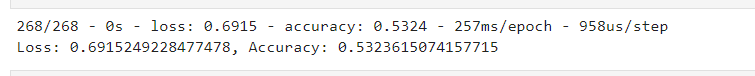

## Neural_Network_Charity_Analysis

### Module 20 Challenge

#### Project Overiew
With skills learned in this module regarding machine learning and neural networks to help create a binary classifier that is capable of predicting if applicants will 
be successful if funded by Alphabet Soup. Using the provided CSV to preprocess data for a neural network model, compile and train the model, and finally create an 
optimized version of the first model created. along with the written analysis (README.md)

#### Deliverables
1. Preprocessing Data for a Neural Network Model
2. Compile, Train, and Evaluate the Model
3. Optimize the Model
4. A Written Report on the Neural Network Model (README.md)

#### Results
##### Data Preprocessing
* What variable are considered the target for your model?
The variables considered for this model is the application time and income amount.
* What variable are considered to be the features for your model?
The variable considered to be features of this model is Classification
* What variable are neither targets nor features, and should be removed from the input data?
The features not used here are affliation, USE CASE, organization, and special considerations

##### Compiling, Training, and Evaluating the Model
* How many neurons, layers, and activation functions did you select for your neural network model?
I selected a variation of changing the number of neurons, hidden layers, and activation method to try to improve the accuracy of this neural network model.

* Were you able to achieve the target model performance?
The mdoel was not able to achieve the target performance, dispite changes made to the layers. 

* What steps did you take to try and increase model performance?
In order to attempt to improve the model's accuracy, the extra hidden layer was added, as well change the number of neurons for each layers, and switching the 
activation for each layer.

### Summary

As this model did not acheive the desired accuracy, I would want to further clean the data to see if that would make a positive impact on the accuracy of this model. 
I would also want to continue to manipulate the hidden layers to attempt a successful model. 

